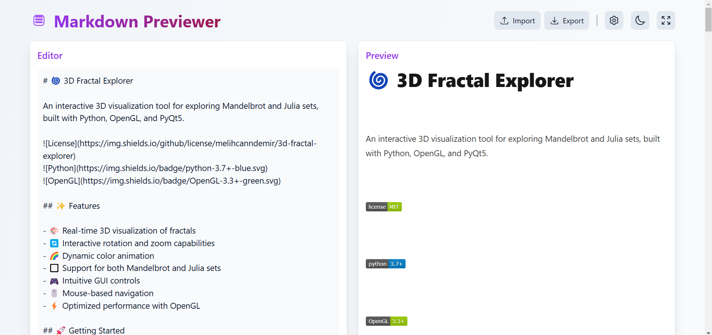
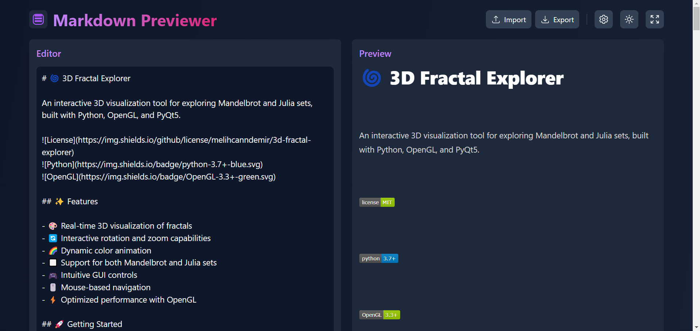

# 📝 Markdown Previewer 


[](https://developer.mozilla.org/en-US/docs/Web/Progressive_web_apps)
[](https://www.w3.org/WAI/standards-guidelines/aria/)
[](https://opensource.org/licenses/MIT)

> A sleek and modern markdown editor and previewer built with React + Vite ⚡


## 📸 Screenshots

### 🌞 Light Mode


### 🌚 Dark Mode


## ✨ Features

- 🌓 Dark/Light mode with smooth transitions
- 💾 Real-time auto-save
- 📱 Fully responsive design for all devices
- 🚀 Live markdown preview
- 🎨 Multiple preview styles (Default, GitHub, Elegant)
- 📋 Import/Export markdown files
- ⚡ Lightning-fast performance with Vite
- 🎯 Customizable settings
- 📊 Optional line numbers
- 🔄 Auto-save functionality
- 📱 PWA support for native app experience
- ♿ Full accessibility support with ARIA labels
- 🔌 Offline functionality
- 📲 Install on any device
- 🎨 Adaptive interface
- 🤖 **NEW!** Gemini AI Assistant for writing assistance

## 🚀 Live Demo

Try it out: [WebMarkdown](https://webmarkdown.netlify.app/)

## 🛠️ Tech Stack

- **Frontend Framework:** React 18.3
- **Build Tool:** Vite 6.0
- **Styling:** Tailwind CSS 3.4
- **PWA:** Vite PWA Plugin
- **AI:** Google Gemini API
- **Key Dependencies:**
  - 🎨 @heroicons/react
  - 📝 react-markdown
  - ✨ remark-gfm
  - 🎯 PropTypes
  - 📱 vite-plugin-pwa
  - 🤖 @google/generative-ai

## 💻 Local Development

1. Clone the repository:
```bash
git clone https://github.com/melihcanndemir/markdown-previewer.git
```

2. Install dependencies:
```bash
npm install
```

3. Start the development server:
```bash
npm run dev
```

4. Build for production:
```bash
npm run build
```

## 🤖 Gemini AI Setup (Optional)

To enable the AI Assistant feature:

1. Get your free API key from [Google AI Studio](https://makersuite.google.com/app/apikey)

2. Create a `.env` file in the root directory:
```bash
cp .env.example .env
```

3. Add your API key to the `.env` file:
```env
VITE_GEMINI_API_KEY=your_actual_api_key_here
```

4. Restart the development server

### AI Assistant Features:
- **Improve Writing:** Enhance clarity and professionalism
- **Fix Grammar:** Correct spelling and punctuation
- **Summarize:** Create concise summaries
- **Expand:** Add more details and explanations
- **Translate:** Turkish ↔ English translation
- **Custom Prompts:** Use your own AI instructions

**Note:** The AI Assistant button will appear in the toolbar once the API key is configured.

## 🎯 Usage

### Editor Features
- Write markdown in the left panel
- See instant preview in the right panel
- Toggle dark/light mode with the theme button
- Use the settings button to customize your experience

### PWA Features
- Install as a native app
- Work offline
- Fast loading times
- Home screen installation
- App-like experience

### Accessibility Features
- Full keyboard navigation
- ARIA labels for all interactive elements
- High contrast mode support
- Screen reader friendly
- Focus management

### Import/Export
- Click Import to load .md files
- Click Export to save your work
- Supports local storage auto-save

### Settings
- Adjust font size
- Choose preview style
- Toggle line numbers
- Enable/Disable auto-save
- Customize PWA behavior

## 📱 Responsive Design

Optimized for all devices:
- 💻 Desktop
- 📱 Tablets (including iPad Air)
- 📱 Foldable devices (including Zenbook Fold)
- 📱 Mobile phones

## 🤝 Contributing

Contributions are welcome! Feel free to:

1. Fork the repository
2. Create your feature branch
3. Submit a Pull Request

## 📜 License

This project is open source and available under the [MIT License](LICENSE).

## 🙏 Credits

- Icons by [Hero Icons](https://heroicons.com)
- Markdown parsing by [React Markdown](https://github.com/remarkjs/react-markdown)
- Styling with [Tailwind CSS](https://tailwindcss.com)
- Built with [Vite](https://vitejs.dev)
- PWA support by [Vite PWA Plugin](https://vite-pwa-org.netlify.app/)

## 👨‍💻 Author

- [@melihcanndemir](https://github.com/melihcanndemir)

---

Made with ❤️ by Melih Can Demir
